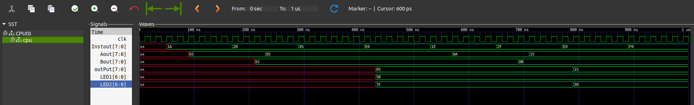

# 8-Bit Von Neumann MicroComputer in Verilog

This project is a simple **8-bit microcomputer** built using **Verilog HDL**, based on the **Von Neumann architecture**, where both program instructions and data share the same memory space. It includes a custom **assembler written in Python** and a demo program to simulate and verify the computer's functionality.

---

## 🔧 Project Structure

- **VerilogModules/**  
  Contains all Verilog source files:
  - `CPU.v`: Top-level module integrating all components
  - `CPU_tb.v`: Testbench for simulation
  - Other submodules (ALU, Control Unit, RAM, etc.)

- **Assembler_v2.py**  
  A Python-based assembly language compiler that converts `.asm` files to binary (`binary.txt`) and auto-updates the RAM module.

- **DemoProgram.asm**  
  A 16-byte sample executable program written in custom assembly language.

- **outputFiles/**  
  Contains output files and waveform dumps from simulations.

---

## 🚀 Getting Started

### 1. ✅ Requirements

Make sure you have the following installed:
- **Python 3**
- **Icarus Verilog (iverilog)** – [Install Guide](https://bleyer.org/icarus/)
- **GTKWave** – Waveform viewer
- **make** – To use the provided Makefile for easy build & simulation

---

### 2. 🛠️ Assembling and Compiling

To compile a custom assembly program:

```bash
$ python3 Assembler_v2.py <input_filename.asm>
```
---
### Expected Output

A sample output (after running the assembly program from this repository) is shown below:


